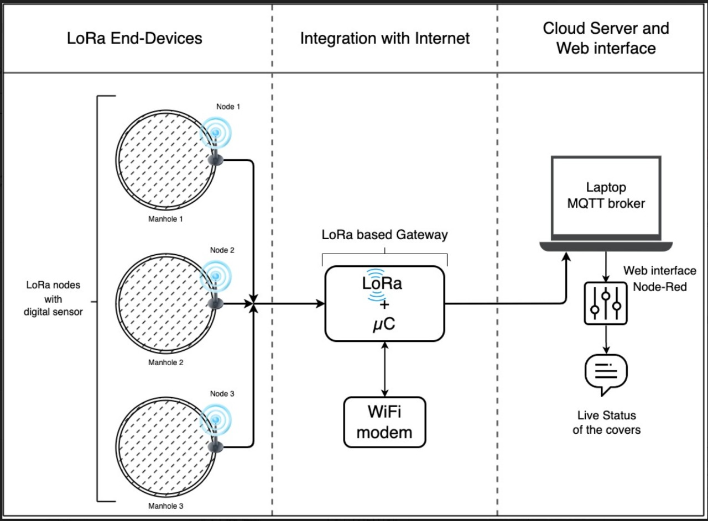
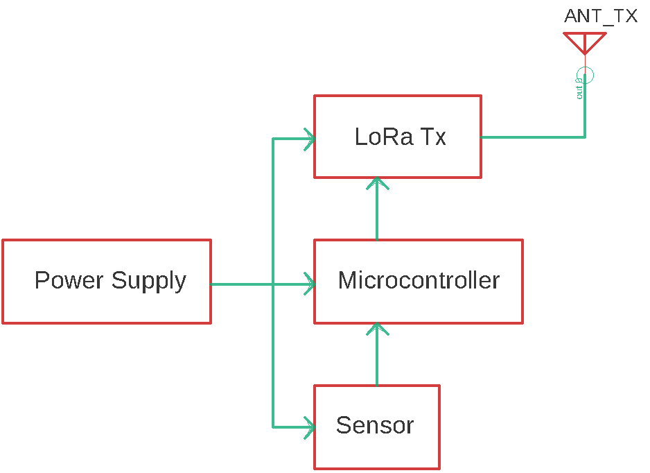
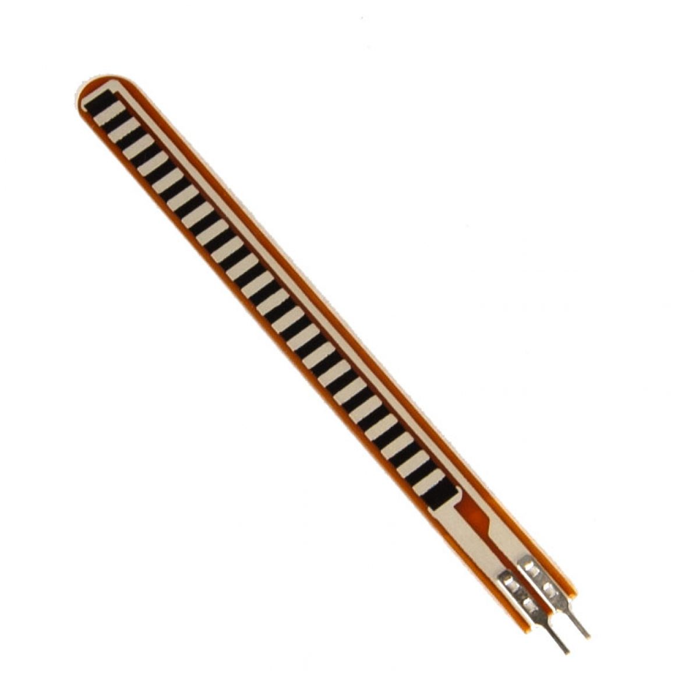
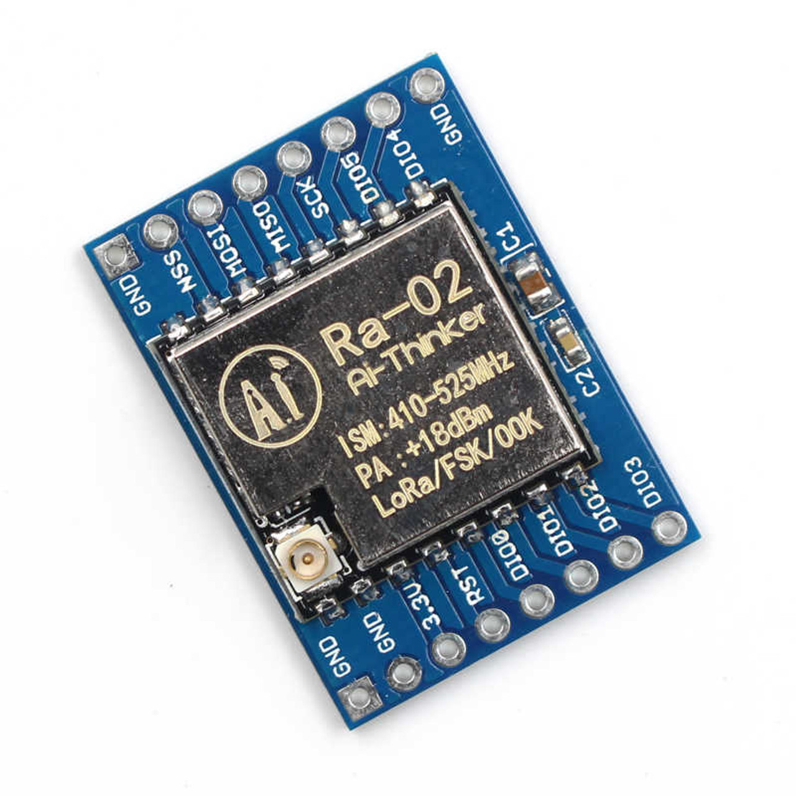
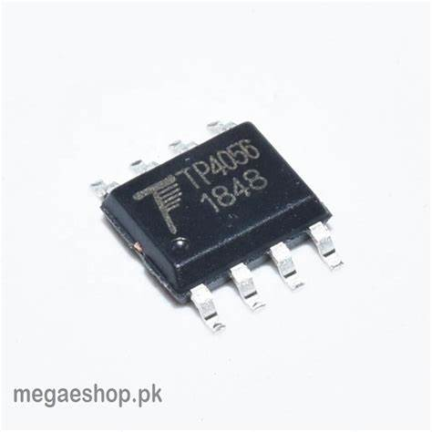
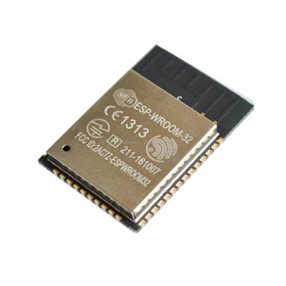
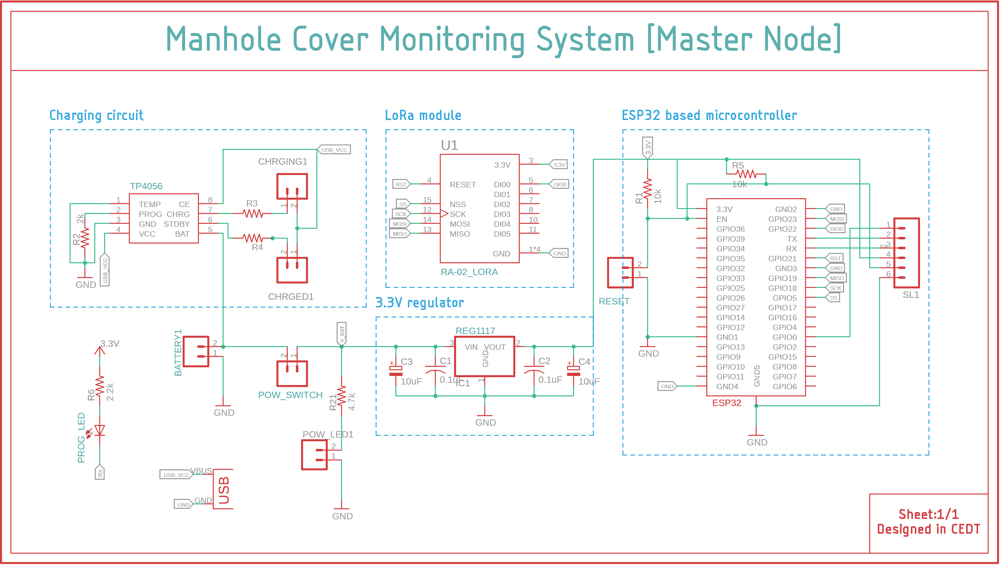

# MCMS (Manhole Cover Monitoring System)

## Problem Statement
Theft of manhole covers is a severe problem faced by our nation that has been left unaddressed for a long time.The repercussions of this thievery not only amount to material losses but also lead to loss of lives. This project proposes a solution to this problem by building a manhole cover monitoring system. Given that a sensor placed inside the manhole will not have reliable connection to the internet, we can directly send the sensor details using internet. This system will give the real-time status of the covers using a LoRa-based gateway to send the data to a cloud server keeping the authorities informed.

## Introduction and Motivation
Theft of manhole covers leads to accidents and deaths. At
first, this might seem like a very unlikely problem, but in
2004 Calcutta witnessed the theft of more than 10000
manhole covers over a period of two months. Thieves
steal these covers to sell them as scrap iron, the profit
made out of these acts is not much but the loss incurred
by society is much greater.
This type of theft is performed at locations experiencing
less traffic and spots which are not monitored with CCTV
cameras. These uncovered holes pose serious danger to
vehicles, especially two-wheelers which end in fatal crashes.
The pedestrians might be able to spot a big hole in daylight
but at night in darkness the chances of any mishappening
increase manifold.
Thus it becomes imperative to come up with a solution
to curb these acts of petty thievery leading to unfortunate
fatalities.

## Proposed Solution

The suggested model is represented in three sections:

1. **LoRa end-devices:** The end devices are composed of sensors capable of
monitoring the status of the cover on the manhole.
The microcontroller reading this sensor is integrated
with a LoRa transmitter.
1. **Integrating internet connectivity:** Signals from the nodes of a given region would be
received by a common LoRa-based gateway connected
to an internet access point.
1. **Cloud server and web interface:** Using the connectivity provided by the gateway, the
data is uploaded to a cloud-based server and displayed
on a web interface or sent to the municipal authorities.

## Block Diagram Representation
|||
|:--:|:--:|
|*Manhole(End Node)*|*Gateway*|

## Six Box Model
The following is the list of requirements for the proposed solution as per the 'Six box Model' for embedded systems:
- Input sensor to detect the status of the manhole cover.
- Wireless technology for transferring sensor information.
- Cloud server acting as the host and storage for the required data.
- Microcontroller to process and control the node and gateway.
- Power supply for the node and gateway.
- Output devices to access the monitoring of the manhole covers.

|1. INPUT- Flex sensor is used as the input sensor to detect the status of the manhole cover by bending at different angles. The resistance of the sensor changes with change in bending angle thereby facilitating the detection of the presence/absence of the cover.||
|:--|--:|
|2. COMMUNICAITON- LoRa communication is used as the preferred communication technology between the sensor node and the gateway because: i) Internet connectivity is not a viable option for the application. ii) LoRa is ideal for low bandwidth battery operated systems as it consumes minimal power ||
|3. HOST & STORAGE- Blynk IOT serves as the cloud service provider. It stores and hosts the cover status of multiple node devices centrally which can then be fetched remotely from anyplace and anytime.||
|4. POWER SUPPLY- The end nodes are powered by a battery and as such need to be charged periodically.The TP4056 is a complete constant-current/constant-voltage linear charger for single-cell lithium-ion batteries. Its SOP package and low external component count make the TP4056 ideally suited for portable applications. The gateway device is powered by a 5V DC adapter||

|5. MICROCONTROLLERS- ATMEGA168 is the microcontroller of choice for the end node as it consumes very less power and has just the right amount of features to cater to the needs of the end device. ESP32 is used as the microcontroller at the gateway as it requires internet connectivity serving as the internet access point for multiple end nodes. The communication between the end-nodes and gateway is done using Lora transceivers as stated earlier|||
|:--|--|--:|

## Circuit Design

### Schematics
||
|:--:|
|*Schematic for End Node*|

||
|:--:|
|*Schematic for Master Node/Gateway*|

### Board Layouts
||
|:--:|
|*END NODE board layout*|

||
|:--:|
|*MASTER NODE board layout*|

 
